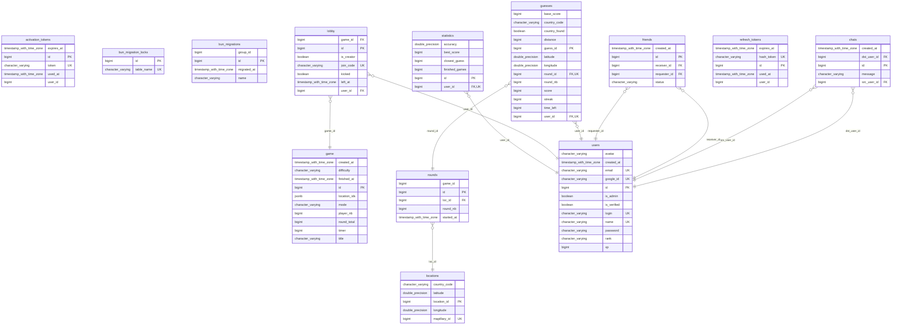

```mermaid
erDiagram
    activation_tokens {
        timestamp_with_time_zone expires_at 
        bigint id PK 
        character_varying token UK 
        timestamp_with_time_zone used_at 
        bigint user_id 
    }

    bun_migration_locks {
        bigint id PK 
        character_varying table_name UK 
    }

    bun_migrations {
        bigint group_id 
        bigint id PK 
        timestamp_with_time_zone migrated_at 
        character_varying name 
    }

    chats {
        timestamp_with_time_zone created_at 
        bigint dst_user_id FK 
        bigint id PK 
        character_varying message 
        bigint src_user_id FK 
    }

    friends {
        timestamp_with_time_zone created_at 
        bigint id PK 
        bigint receiver_id FK 
        bigint requester_id FK 
        character_varying status 
    }

    game {
        timestamp_with_time_zone created_at 
        character_varying difficulty 
        timestamp_with_time_zone finished_at 
        bigint id PK 
        jsonb location_ids 
        character_varying mode 
        bigint player_nb 
        bigint round_total 
        bigint timer 
        character_varying title 
    }

    guesses {
        bigint base_score 
        character_varying country_code 
        boolean country_found 
        bigint distance 
        bigint guess_id PK 
        double_precision latitude 
        double_precision longitude 
        bigint round_id FK,UK 
        bigint round_nb 
        bigint score 
        bigint streak 
        bigint time_left 
        bigint user_id FK,UK 
    }

    lobby {
        bigint game_id FK 
        bigint id PK 
        boolean is_creator 
        character_varying join_code UK 
        boolean kicked 
        timestamp_with_time_zone left_at 
        bigint user_id FK 
    }

    locations {
        character_varying country_code 
        double_precision latitude 
        bigint location_id PK 
        double_precision longitude 
        bigint mapillary_id UK 
    }

    refresh_tokens {
        timestamp_with_time_zone expires_at 
        character_varying hash_token UK 
        bigint id PK 
        timestamp_with_time_zone used_at 
        bigint user_id 
    }

    rounds {
        bigint game_id 
        bigint id PK 
        bigint loc_id FK 
        bigint round_nb 
        timestamp_with_time_zone started_at 
    }

    statistics {
        double_precision accuracy 
        bigint best_score 
        bigint closest_guess 
        bigint finished_games 
        bigint id PK 
        bigint user_id FK,UK 
    }

    users {
        character_varying avatar 
        timestamp_with_time_zone created_at 
        character_varying email UK 
        character_varying google_id UK 
        bigint id PK 
        boolean is_admin 
        boolean is_verified 
        character_varying login UK 
        character_varying name UK 
        character_varying password 
        character_varying rank 
        bigint xp 
    }

    chats }o--|| users : "dst_user_id"
    chats }o--|| users : "src_user_id"
    friends }o--|| users : "receiver_id"
    friends }o--|| users : "requester_id"
    lobby }o--|| game : "game_id"
    guesses }o--|| rounds : "round_id"
    guesses }o--|| users : "user_id"
    lobby }o--|| users : "user_id"
    rounds }o--|| locations : "loc_id"
    statistics }o--|| users : "user_id"
```